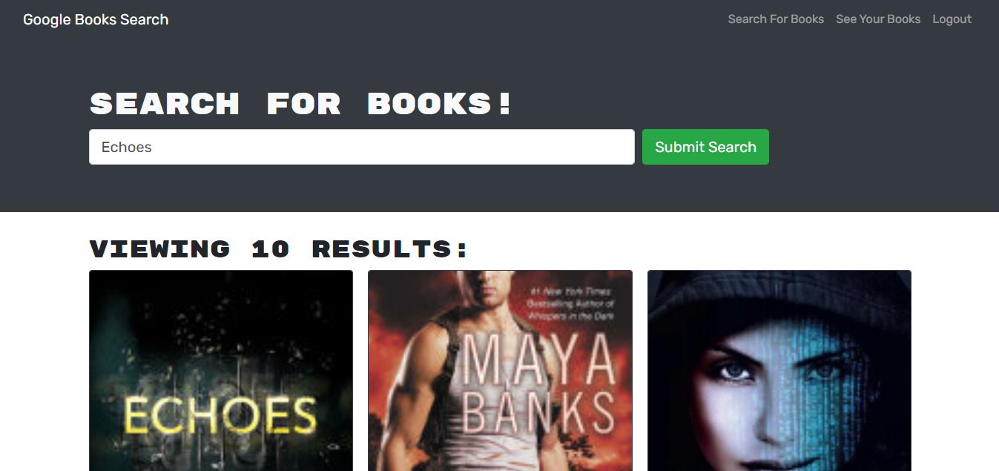
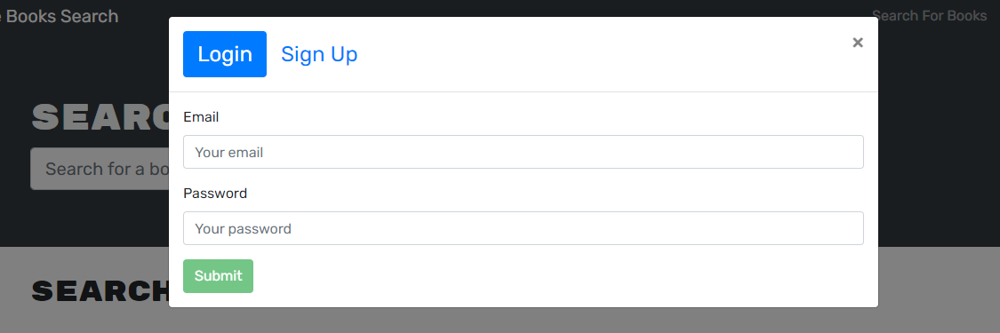

# Book Search API


## Table of Contents
- [Project Overview](#project-overview) 
- [Live Application](#live-application)
- [Installation](#installation)
- [License](#license)
- [Screenshots](#screenshots)

## Project Overview
Full stack MERN application for searching Google Books API. Built using MERN stack: React front end, MongoDB database, and Node.js/Express.js server using GraphQL API and Mongoose ODM. User authentication is achieved using the JSON Web Token library along with Apollo Server for managing context within the application.

[View the application](https://captain63-book-search.herokuapp.com/) on Heroku.

### Languages Used
- JavaScript (React)
- MongoDB
- HTML
- CSS

### Node Libraries Used
- [Apollo Server](https://www.npmjs.com/package/apollo-server-express)
- [Express](https://www.npmjs.com/package/express)
- [JSON Web Token](https://www.npmjs.com/package/jsonwebtoken)
- [GraphQL](https://www.npmjs.com/package/graphql)
- [Mongoose](https://www.npmjs.com/package/mongoose)
- [React](https://www.npmjs.com/package/react)
- [React Bootstrap](https://www.npmjs.com/package/react-bootstrap)

See [server package.json](./server/package.json) and [client package.json](./client/package.json) for full list of dependencies.

### Additional Libraries/APIs
- [Google Books API](https://developers.google.com/books)
- [Bootstrap](https://www.npmjs.com/package/bootstrap)

## Live Application
[View the application](https://captain63-book-search.herokuapp.com/) on Heroku.

## Installation
To run this application on your local machine, Node.js is _required_. Once cloned/downloaded from GitHub, enter ```npm i``` in command line to install the packages referenced under Libraries Used automatically. 
You are now be ready to launch the application by entering ```npm run dev```.

## License
Permission is hereby granted, free of charge, to any person obtaining a copy of this Software and associated documentation files (the "Software"), to deal in the Software without  restriction, including without limitation the rights to use, copy, modify, merge, publish distribute, sublicense, and/or sell copies of the Software, and to permit persons to whom the Software is furnished to do so, subject to the following conditions.

[View the full license](./LICENSE)

## Screenshots




